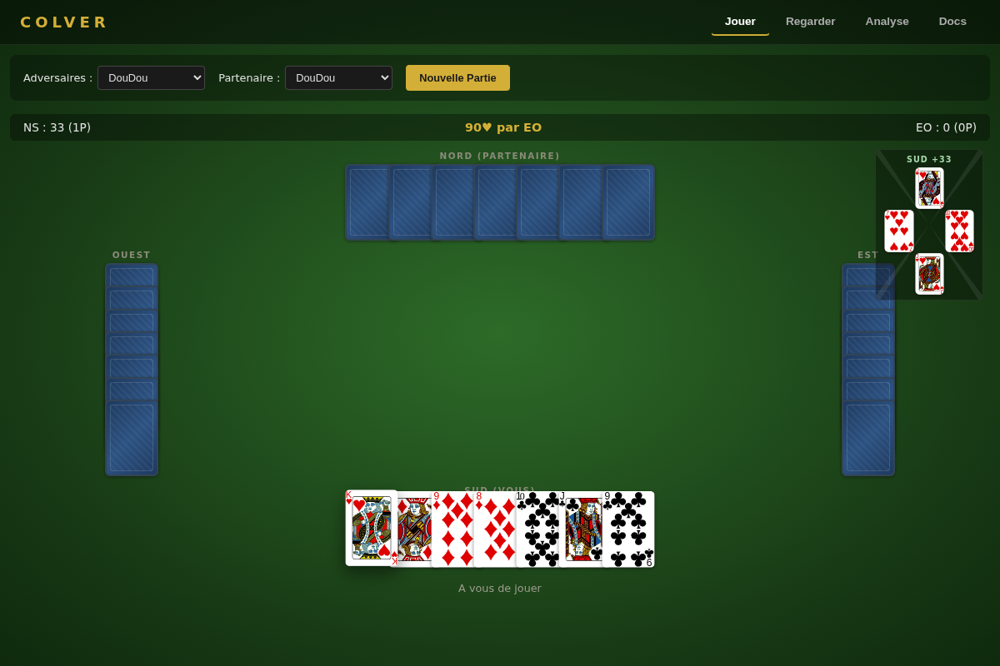
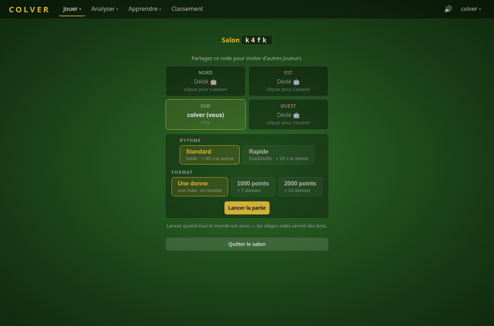
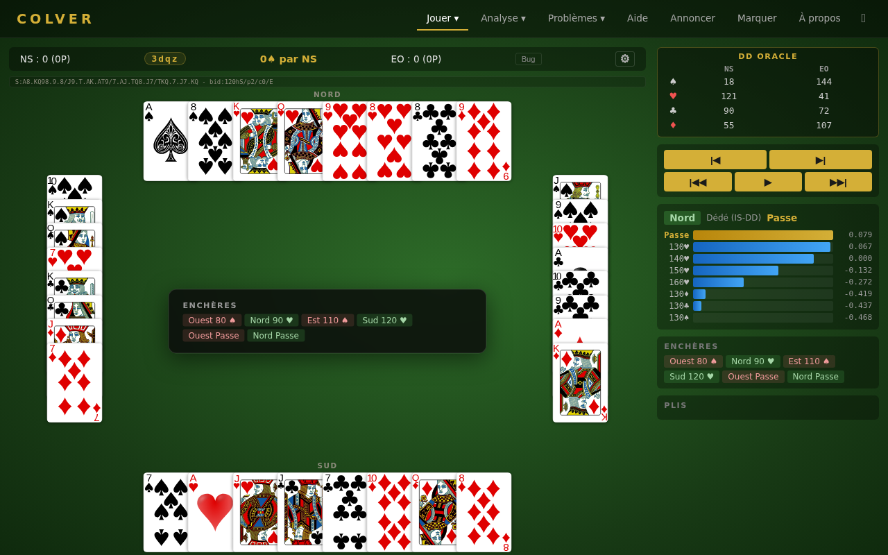
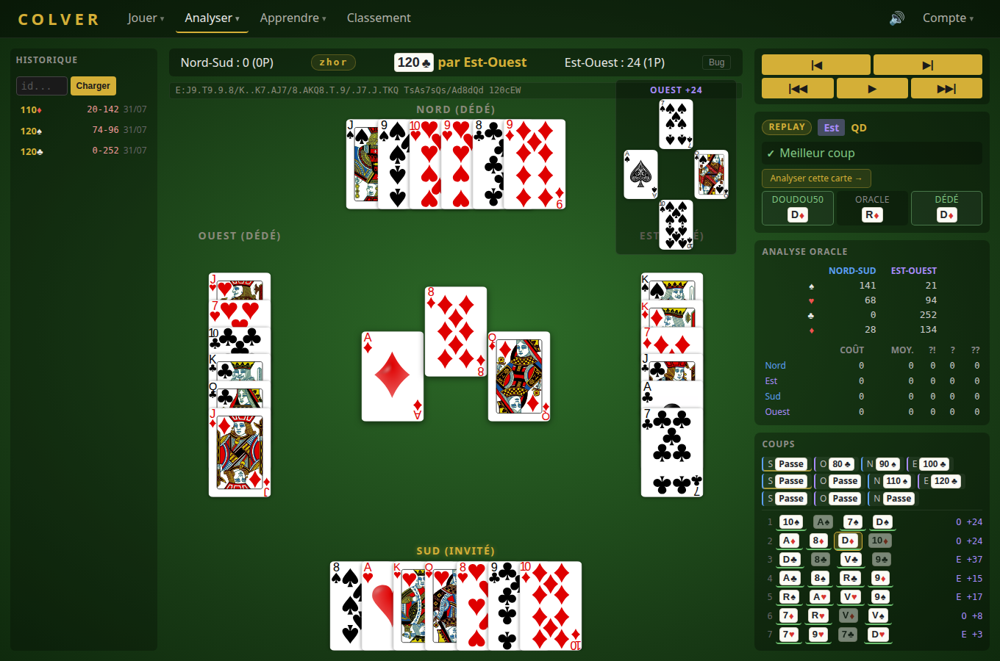
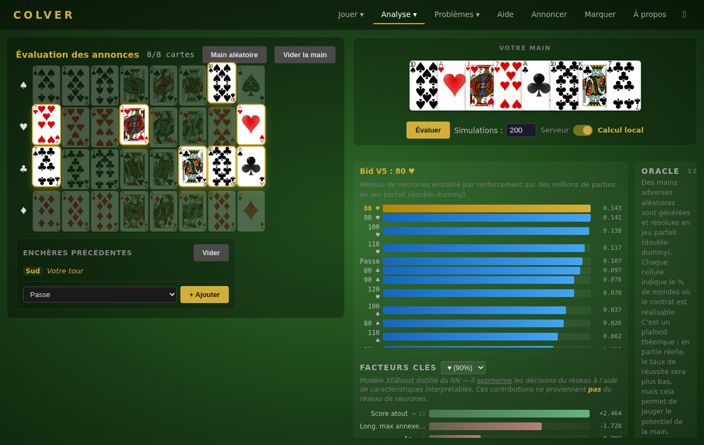
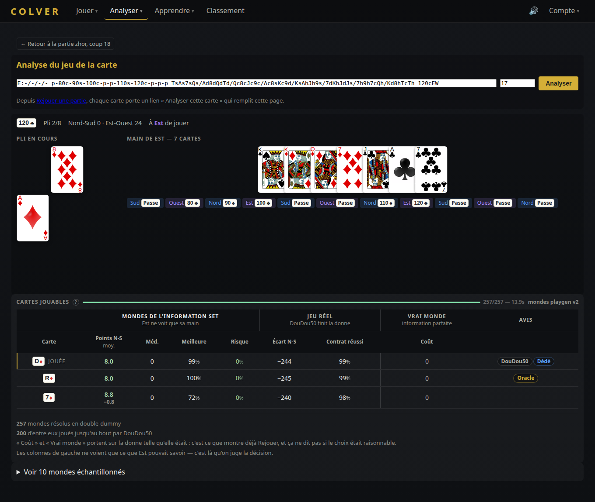
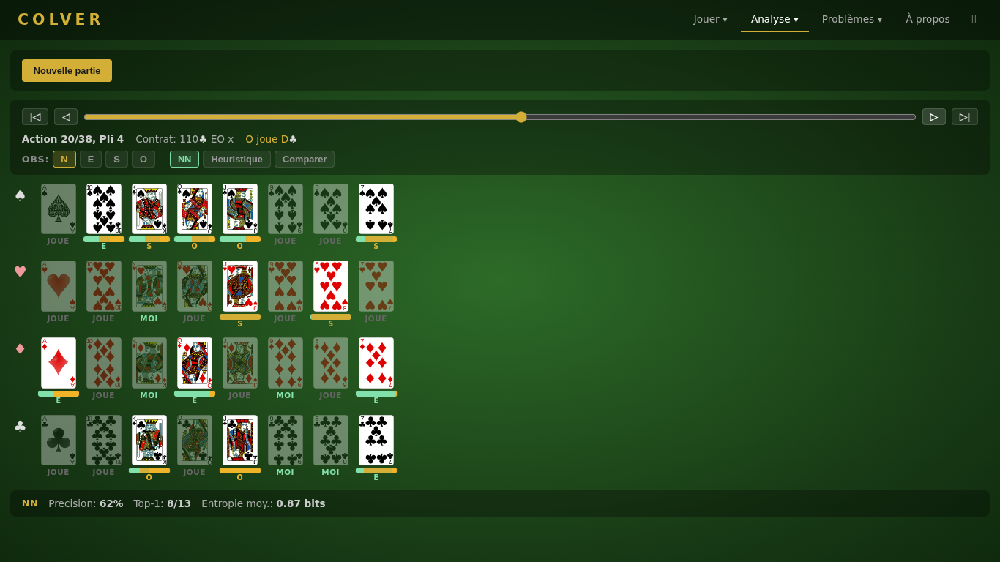
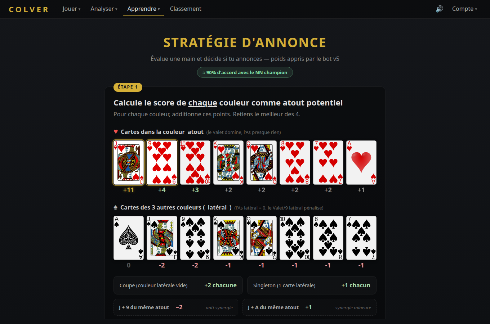
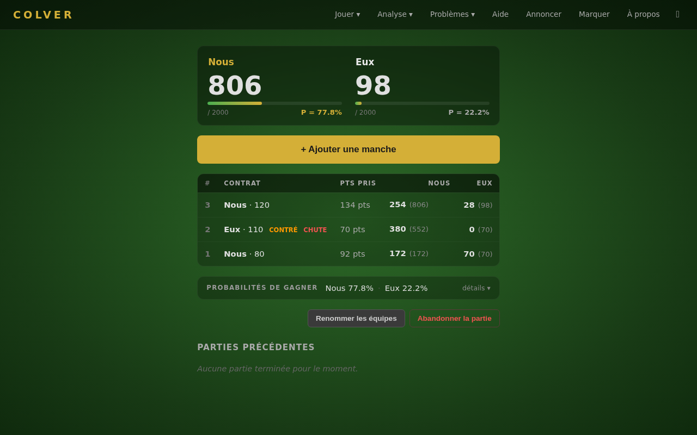

<p align="center">
  
</p>

# Colver

**[Read in English](README.md)**

Environnement de Belote Contree rapide pour l'apprentissage par renforcement. Moteur Rust avec bindings Python.

**Jouer en ligne : [colver.net](https://colver.net)** — un site public auto-heberge : parties solo ou multijoueur, comptes, classement et analyse.

## Caracteristiques

- **~1.4M rollouts/sec** en mono-thread (phase de jeu), ~895K rollouts/sec sur une donne complete
- **Etat de jeu `Copy` de <=96 octets** pour un clonage MCTS performant
- **Six agents IA** — reseau Q DMC, IS-DD, oracle DD, Smart/Naive IS-MCTS, et heuristique
- **Encheres par reseau de neurones** — "Bid V6 IS-DD", un Dueling DQN score-aware et belote-aware (117→512³→43) entraine 75M etapes sur points reels IS-DD avec simulation de match complete
- **Interpretabilite ML** — distillation XGBoost + sondage de couche cachee revelent le systeme de scoring implicite du NN, traduit en regles utilisables par un humain (88-94% d'accord)
- **Modele de mondes Playgen** — un transformer causal qui prolonge une donne a partir de ce qu'un seul siege voit ; le derouler revele les mains cachees, et c'est de la que viennent desormais les mondes echantillonnes par IS-DD
- **Une seule couche d'agents** — un bot est une spec TOML (`[bid]` / `[play]` / `[worlds]`), construite cote Rust et pilotee a l'identique par l'arene, le web et `colver.Agent`
- **Interface web** — jouez en solo ou en salon multijoueur, observez, rejouez avec analyse carte par carte, entrainez-vous sur des problemes (FastAPI + WebSocket)
- **Bindings Python** via PyO3 — `Env`, `Agent`, `Analyst` et `Beliefs` avec stubs de types complets, installable depuis PyPI
- Zero dependances dans le coeur (seulement `rand` derriere un feature flag)

## Interface Web

Jouez contre les agents IA directement dans le navigateur sur **[colver.net](https://colver.net)**, ou lancez-le en local :

```bash
uv run python -m colver.web
# Ou : uv run colver-web
# Ouvrir http://localhost:8000
```

Quatre destinations : **Jouer**, **Analyser**, **Apprendre**, **Classement**. Le compte est facultatif — c'est lui qui rattache les parties a un joueur, rend les parties reprenables et les fait classer.

### Jouer

**Humain vs IA** — Jouez en Sud contre trois bots. Exactement deux reglages, tous deux choisis avant la donne :

- **Tempo** — `Standard` (Dede, ~40 s la donne) ou `Rapide` (DouDou50, ~15 s). Le couplage est voulu : une recherche IS-DD coute du temps reel par coup, donc un tempo rapide n'est honnete que derriere un bot qui repond instantanement. Les quatre sieges IA jouent le meme bot — une table ou le partenaire est plus faible que les adversaires ne dit rien de la facon dont vous avez joue.
- **Format** — une donne seche (defaut), ou une partie en 1000 / 2000 points. Le score cumule part aux bots, et Bid V6 le lit : il n'annonce pas la meme chose a 900-200 qu'a 0-0.

Vos cartes sont jouees instantanement au clic ; la pause appartient a la position *precedant* un coup, et le bot reflechit dedans, pas par-dessus. Le passe force est joue pour vous, le dernier pli — ou plus personne n'a de choix — se deroule tout seul, et la derniere levee reste 2 s a l'ecran avant le panneau de fin. Connecte, on peut quitter une partie et la reprendre plus tard.



**Salon multijoueur** — Des salons a code de 4 caracteres ; les bots occupent les sieges que les humains ne prennent pas. L'hote choisit le tempo et le format. Chaque etat diffuse est filtre sur la main du destinataire et pivote pour qu'il soit toujours assis en Sud. Les sieges sont lies aux comptes : un joueur deconnecte retrouve le sien.



**IA vs IA** — Observez des parties IA contre IA avec toutes les mains visibles. Assignez un agent different a chacune des 4 places. Avancez action par action, jouez des plis entiers, ou utilisez la lecture automatique. Le panneau de stats affiche les Q-values, scores DD ou evaluations de main. Collez une chaine CFN pour charger une position specifique.



### Analyser

**Rejouer** — Parcourez et rejouez les donnes passees (jouees, observees ou partagees), coup par coup. Deux passes d'analyse independantes s'y ajoutent, chacune mise en cache et chargee separement pour que la lente ne bloque jamais la rapide :

- la **passe DD** — le cout exact de chaque carte, plus une revue d'enchere portant deux avis par annonce : les Q-values de Bid V6 et la tete d'enchere 43-voies de playgen ;
- la **revue d'agents** — ce que DouDou50, l'Oracle et Dede auraient joue a chaque carte non forcee, envoyee au fil du calcul.

Chaque carte et chaque annonce porte un lien vers sa page d'analyse, et le chemin du retour.



**Annonces** — Composez une main de 8 cartes, posez les encheres qui ont precede votre tour, et voyez ce que *Bid V6 IS-DD* annoncerait — les Q-values de chaque action legale, plus un panneau "Facteurs cles" distille par XGBoost. Deux tableaux jouent ensuite la main sur des centaines de distributions des 24 autres cartes : **Jeu parfait** (chaque donne resolue en double-dummy par l'Oracle — un plafond theorique) et **Jeu reel** (l'enchere complete menee par le NN aux quatre places, puis 8 plis joues par DouDou50 — ce qui arrive vraiment). Un onglet par annonce analysee, donc deux annonces sur la meme main se comparent cote a cote ; les mains analysees restent dans une barre laterale. Tourne cote serveur ou entierement dans le navigateur via WASM ("Calcul local").



**Jeu de la carte** — Une ligne par carte jouable a une position donnee, pour repondre a deux questions qu'il ne faut pas confondre : *les mondes de l'information set* (des donnes compatibles avec ce que le siege pouvait savoir, chacune resolue en double-dummy — c'est la qu'on juge la decision) et *le vrai monde* (un seul solve exact, sur la donne telle qu'elle etait). Un troisieme bloc force la carte et laisse DouDou50 finir la donne. Une carte deuxieme dans la vraie donne mais meilleure dans 70 % des mondes etait un bon coup contre de la malchance.



**Croyances** — Regardez *playgen* localiser les cartes cachees au fil d'une donne, pendant l'enchere comme pendant le jeu. Avancez pas a pas et lisez les barres de probabilite par carte face a la verite terrain, depuis chacun des quatre sieges.



**Problemes d'annonce** — Problemes d'encheres. Voyez une main et l'historique des encheres, puis trouvez la bonne annonce. L'IA evalue votre reponse.

**Problemes de jeu** — Problemes de jeu de la carte. Voyez une position en cours de partie et trouvez la meilleure carte. Comparez votre choix au jeu optimal du solveur DD.

### Apprendre

**Aide-memoire** — Aide-memoire visuel : ordre de force et valeur des cartes (atout / non-atout), points de la donne, regles d'encheres.

**Guide des annonces** — Guide de strategie visuel derive du bot par ML : ponderation par carte, regles de decision par position, regle du miroir en defense. 88-94% d'accord avec le NN, memorisable en quelques minutes.



**Marquer les points** — Compteur de points pour vos vraies parties. Choisissez un score cible (1000-3000), ajoutez des manches avec un formulaire qui calcule automatiquement les scores exacts aux regles FFB (contrat, multiplicateur coinche/surcoinche, points faits, belote), et suivez la probabilite de victoire mise a jour apres chaque manche. Tout vit dans le navigateur — pas de serveur, pas de compte.



### Classement

Un Elo par entite classee — un compte humain ou un type de bot — mis a jour donne par donne des que les quatre sieges sont identifiables. Les bots ont un K plus faible : ce sont des points de repere, et ils occupent jusqu'a trois sieges par partie.

## Compilation et execution

Necessite Rust 1.70+ et Python 3.10+.

```bash
# Tests (418 tests)
cargo test -p colver-core

# Benchmark de performance
cargo run -p colver-core --bin bench --release

# Demo MCTS vs aleatoire
cargo run -p colver-core --bin mcts_demo --release -- 100

# Demo Smart IS-MCTS vs aleatoire + vs naif
cargo run -p colver-core --bin smart_ismcts_demo --release -- 100

# Bindings Python (via uv)
uv sync
uv run python3 -c "import colver; env = colver.Env(); print(env.reset())"

# Interface web (jouer contre l'IA)
uv run python -m colver.web

# Bot contre bot, 200 matchs dans chaque sens (les bots sont des TOML dans arena/bots/)
cargo run --bin arena --release -- h2h v6_isdd_75M_belief v6_isdd_75M --matches 200

# Entrainement conjoint enchere + jeu (GPU, candle)
cargo run -p colver-core --bin train_joint --features dmc_train --release -- --num-envs 256 --steps 35000000

# Sidecar GPU playgen — la source de mondes d'IS-DD
cargo run -p colver-core --bin playgen_gpu_server --features gpu_server --release -- --playgen models/playgen/playgen_v2_final.bin --port 8003
export COLVER_PLAYGEN_GPU_URL=http://localhost:8003
```

Sans `$COLVER_PLAYGEN_GPU_URL`, les bots IS-DD retombent sur des mondes uniformes sous contraintes (le web l'annonce dans les stats de la decision ; l'arene, elle, refuse de construire le bot si la spec ne le demande pas explicitement).

## Agents IA

### Oracle — Solveur DD (`solver.rs`)

Solveur double-dummy en information parfaite qui voit les 4 mains — il *triche*. Alpha-beta avec tables de transposition, PVS, killer moves et elagage par equivalence de cartes. Calcule la carte optimale exacte en ~35 ms sur donne complete, ~190 us en mi-partie et ~1,5 us en finale (mesure du 2026-08-02, 1 thread). Utile comme borne superieure.

### Dede — IS-DD (`is_dd.rs`)

Recherche Information Set Double-Dummy : echantillonner des donnes compatibles avec ce que ce siege peut savoir, resoudre chacune exactement avec le solveur alpha-beta DD, agreger. Les contraintes dures (coupes revelees par le jeu, plafond d'atout, cartes deja tombees) sont des faits et s'appliquent toujours. Les mondes viennent d'une `WorldSource` que l'agent possede — **playgen via le sidecar GPU par defaut**, avec un echantillonnage uniforme sous contraintes en repli. Un **reseau de croyances** peut en plus ponderer le tirage. IS-DD se prononce « is Dede » — d'ou le surnom.

### DouDou50 — Reseau Q DMC (`dmc_net.rs`)

Agent par apprentissage par renforcement de style [DouZero](https://arxiv.org/abs/2106.06135). Un reseau Q choisit les cartes a jouer en une seule passe forward — **sans arbre de recherche**. Modele de jeu par defaut, entraine sur 50M etapes avec l'encherisseur NN gele (phase play-only du triforge).

**Architecture** : ResNet Dueling DQN 411→1024→1024→1024→32 avec LayerNorm et skip connections (~2.6M parametres). Utilise un encodage canonique des couleurs (pas d'augmentation necessaire). Inference en Rust pur (~1ms/decision, pas de PyTorch necessaire). Agent le plus fort dans l'ensemble.

L'ancien modele **DouDou35** (415→1024³→32, obs legacy, 35M etapes) reste supporte. *DouDou* = en reference a DouZero.

### Playgen — modele de mondes (`playgen/`)

Un transformer causal (10,7M parametres) entraine a prolonger une donne de maniere autoregressive a partir du prefixe visible par un seul observateur. Le derouler revele les mains cachees : un deroulement *est* donc un monde determinise tire d'une posterieure apprise, et non d'un melange uniforme — c'est ce qu'IS-DD echantillonne, et ce que la page Croyances affiche. La v2 porte en plus une tete d'enchere 43-voies, qui rend possible l'echantillonnage en cours d'enchere (et, par curiosite, l'usage de playgen comme encherisseur). Il tourne sur CPU ou CUDA ; en production un sidecar (`playgen_gpu_server`) le sert en HTTP, ~50x plus vite que sur CPU.

### Anciens agents de recherche

**Smart IS-MCTS** (`smart_ismcts.rs`) — [IS-MCTS](https://doi.org/10.1109/TCIAIG.2012.2200894) pondere par croyances heuristiques. **Naive IS-MCTS** (`naive_ismcts.rs`) — Determinisation par ensemble sans croyances. Les deux sont configurables et documentes dans [docs/play/smart_ismcts.md](docs/play/smart_ismcts.md).

### Bid V6 IS-DD — Encherisseur NN (`bid_net.rs`)

Dueling DQN **117→512→512→512→43** avec observation score-aware v3 (features de score de match + 4 bits de belote). Entraine **75M etapes sur points reels IS-DD** (pas DD oracle) avec reward belote-aware et **simulation de match** complete (scores cumules, rotation du donneur, reset a 2000). Bat le champion precedent Bid V5 dans les deux jeux d'evaluation (55.8% en jeu DMC, 57.3% / +181 pts en jeu IS-DD). `BidNet::load` detecte automatiquement la taille cachee et obs_dim (108 / 110 / 113 / 117).

Versions precedentes toujours supportees via auto-detection :
- **Bid V5 IS-DD** — obs score-aware 113-dim, 25M etapes sur points reels IS-DD
- **Bid V3 Max** — 108-dim, entraine sur `max(DMC, IS-DD)` points reels (20M etapes)
- **Bid a Dede** (v2) — 108-dim, reward DD oracle
- **Bid a Doudou** (v1) — 114→256² dueling, self-play DouZero

**Interpretabilite** : distillation XGBoost et sondage lineaire sur la couche cachee revelent que le scoring implicite du NN differe nettement de l'evaluation classique (ex. V atout = +11 effectif, 9 = +4, A atout = +1, A lateral = 0 net ; plus une anti-synergie V×9 = −2). Traduit en un arbre de decision a 5 features atteignant 88-94% d'accord avec le NN — voir [docs/bid/strategies/bid_v5_human_guide.md](docs/bid/strategies/bid_v5_human_guide.md) et [docs/bid/interpretability/probe_morning_report.md](docs/bid/interpretability/probe_morning_report.md).

## Comparaison des agents

| Agent | Type | Vitesse/coup | Notes |
|---|---|---|---|
| Oracle (DD) | Solveur DD (triche) | 35 ms -> 1,5 us (pli 1 -> pli 8) | Borne superieure |
| Dede (IS-DD) | Solveur DD sur mondes echantillonnes | budget (1 s sur le web) | Plus fort avec recherche |
| **DouDou50** | **Reseau Q (ResNet)** | **<1ms** | Plus fort, sans recherche |
| Smart IS-MCTS | Recherche + croyances | ~9ms | Budget configurable |
| Naive IS-MCTS | Recherche | ~8ms | Budget configurable |

**Note** : Les agents a base de recherche voient leur force augmenter avec le budget de temps. L'agent DMC n'utilise aucune recherche — la decision est prise en une seule inference.

## Un bot est une spec, pas un chemin de code

Un bot est un fichier TOML decrivant un encherisseur, un joueur de cartes et (pour IS-DD) une source de mondes. L'arene, le frontend web et `colver.Agent` lisent la meme spec et obtiennent le meme agent — il n'existe aucune seconde implementation.

```toml
[bid]
strategy = "nn"                    # heuristic|improved|smart|roro|maxi|nn|playgen|…
model = "models/bid_v6_isdd_resume/bid_nn_final.bin"

[play]
method = "isdd"                    # isdd|dmc|dmc_then_isdd|ismcts|smart_ismcts|oracle_dd|heuristic
time_ms = 1000

[worlds]                           # IS-DD uniquement ; sidecar par defaut
source = "sidecar"
url = "http://localhost:8003"
```

`arena/bots/*.toml` contient les bots de reference ; les resultats en face-a-face et en round-robin s'accumulent dans `arena/results/matches.csv`. Tester une nouvelle combinaison, c'est ecrire un fichier, pas recompiler.

## Architecture

**Workspace :** `colver-core` (Rust pur) + `colver-py` (PyO3/NumPy FFI) + `colver-wasm` (solveur dans le navigateur) + `python/colver/web` (FastAPI/WebSocket)

### Representation des cartes

Systeme de bitmask : `Card = u8` (0-31), `CardSet = u32` (bitmask). Disposition : Pique\[0-7\], Coeur\[8-15\], Carreau\[16-23\], Trefle\[24-31\]. Dans chaque couleur : 7, 8, 9, V, D, R, 10, A (ordre de force hors atout). Force a l'atout : V > 9 > A > 10 > R > D > 8 > 7.

### Etat de jeu

`GameState` est `Copy` et fait <=96 octets (verifie a la compilation) pour un clonage MCTS rapide. Contient les mains, le pli courant, le contrat, les points/plis par equipe, l'etat des encheres, le bitmask des cartes jouees, le suivi des coupes et de la belote.

### Encodage des actions

| Phase | Actions | Encodage |
|---|---|---|
| Encheres | 43 total | 0=PASSE, 1-36=encheres (9 valeurs x 4 couleurs), 37-40=capot x 4, 41=COINCHE, 42=SURCOINCHE |
| Jeu | 32 total | Index de carte 0-31 directement |

### Deroulement

Encheres → Jeu → Fin. Les encheres se terminent apres 3 passes consecutives, une surcoinche, ou 4 passes (donne nulle). Le jeu comporte 8 plis de 4 cartes. Total des points de carte = 152 ; avec dix de der = 162 (normal) ou 252 (capot).

## API Python

```python
import colver

print(colver.__version__)  # "0.9.1"

# Environnement unique
env = colver.Env()
obs, legal_actions = env.reset()
obs, reward, done, legal_actions = env.step(action)

env.current_player()       # 0-3
env.phase()                # 0=Encheres, 1=Jeu, 2=Fin
env.legal_action_mask()    # tableau numpy (43,)
env.rewards()              # [score_NS, score_EO]
env.bid_improved()         # action d'enchere improved_bid
env.deal_outcome()         # [resultat_NS, resultat_EO] binaire
env.get_observation()      # vecteur d'observation de 415 flottants
env.action_naive_ismcts(20)  # action IS-MCTS naif (20ms)
env.action_smart_ismcts(20)  # action IS-MCTS intelligent (20ms)

# Reseau Q DMC (si les poids du modele sont telecharges)
model = colver.model_path()  # ~/.cache/colver/models/dmc_final.bin
if model:
    env.load_dmc_model(str(model))
    result = env.action_dmc_with_stats()  # {"best_action": 5, "q_values": [...]}

# Un bot complet a partir d'une spec — le meme TOML que lit l'arene
agent = colver.Agent(spec_toml, seat=2)
agent.init_deal(env)
agent.observe(env, action)       # toutes les actions, y compris les votres
decision = agent.decide(env)     # {"action": …, plus les stats de la methode}

# Playgen comme analyste : marginales des cartes cachees, mondes, politique d'enchere
analyst = colver.Analyst("models/playgen/playgen_v2_final.bin")
analyst.init_deal(env, observer=2)
probs = analyst.marginals(env, n_worlds=50)
```

## Performance

| Charge | Debit | Latence |
|---|---|---|
| Rollout phase de jeu | 1.4M/sec | ~720 ns |
| Rollout donne complete | 895K/sec | ~1118 ns |
| Partie MCTS (1000 iter) vs aleatoire | — | 8 ms |
| Partie Smart IS-MCTS (20x50) vs aleatoire | — | 9 ms |
| Inference DMC Q-Network | — | <1 ms |

## Docker

L'image Docker permet de deployer l'interface web sur n'importe quelle machine, x86-64 ou ARM64.

```bash
# Build et lancement
docker build -t colver .
docker run -p 8000:8000 colver

# Ou avec Docker Compose
docker compose up -d

# Cross-build pour ARM64
docker buildx build --platform linux/arm64 -t colver .
```

L'image fait ~257 Mo (pas de dependance PyTorch). Tous les agents tournent en Rust pur et fonctionnent sur toutes les architectures.

## Regles

Implemente la Belote Contree avec 4 couleurs (Pique, Coeur, Carreau, Trefle). Comptage en mode "points faits + points demandes", les multiplicateurs coinche (x2) et surcoinche (x3) ne portant que sur la valeur du contrat. Sur une chute, la defense prend le contrat *et* tous les points cartes, quel que soit le partage reel des plis.

Les scores sont **exacts — rien n'est arrondi**. La FFB arrondit la marque a la dizaine ; ici une chute marque 162 + le contrat, pas 160, de sorte que le moteur et la feuille de score du web affichent toujours le meme chiffre. Voir `REGLES-DE-LA-BELOTE-CONTREE.pdf` pour le reglement complet FFB.

## References

- Kocsis, L. et Szepesvari, C. (2006). [Bandit Based Monte-Carlo Planning](https://link.springer.com/chapter/10.1007/11871842_29). *ECML*.
- Cowling, P.I., Powley, E.J. et Whitehouse, D. (2012). [Information Set Monte Carlo Tree Search](https://doi.org/10.1109/TCIAIG.2012.2200894). *IEEE Transactions on Computational Intelligence and AI in Games*.
- Zha, D. et al. (2021). [DouZero: Mastering DouDiZhu with Self-Play Deep Reinforcement Learning](https://arxiv.org/abs/2106.06135). *ICML*.
- Auer, P., Cesa-Bianchi, N. et Fischer, P. (2002). [Finite-time Analysis of the Multiarmed Bandit Problem](https://homes.di.unimi.it/~cesabian/Pubblicazioni/ml-02.pdf). *Machine Learning*.

## Remerciements

Merci a **Ronan Guillou**, joueur de coinche aguerri, pour ses conseils avises sur le jeu et pour avoir ete le premier testeur — son bon sens a guide de nombreux choix d'interface.
