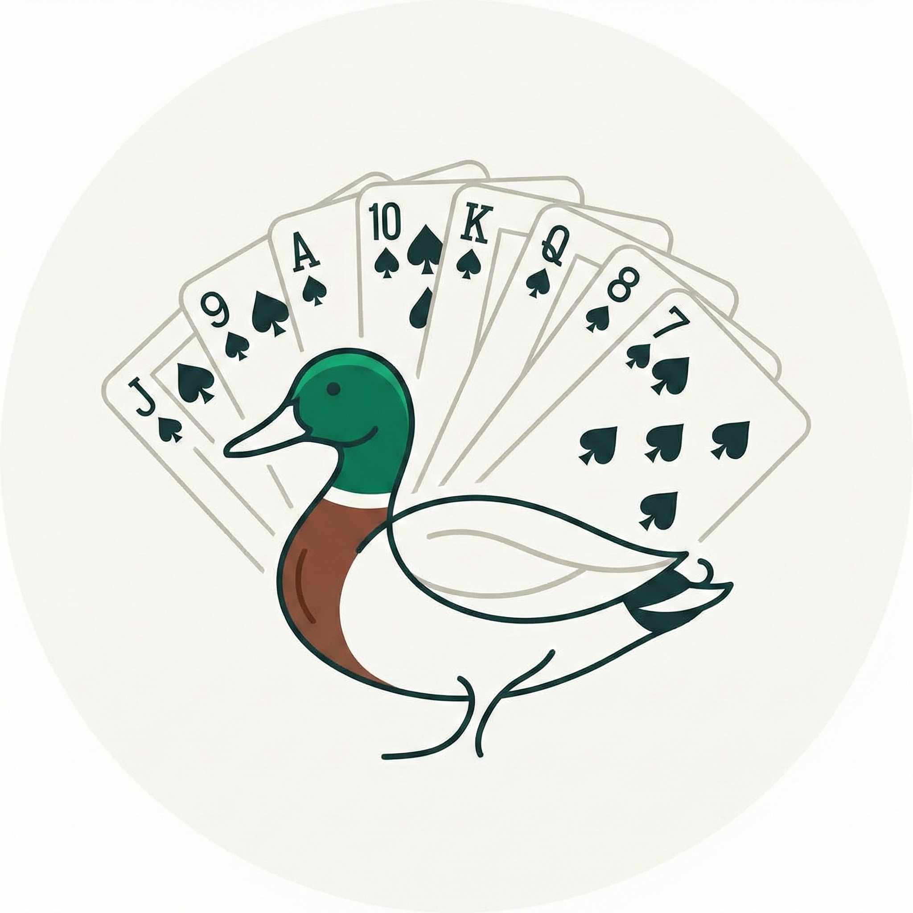

<p align="center">
  
</p>

# Colver

Environnement de Belote Contree rapide pour l'apprentissage par renforcement. Moteur Rust avec bindings Python.

## Caracteristiques

- **~1.4M rollouts/sec** en mono-thread (phase de jeu), ~895K rollouts/sec sur une donne complete
- **Etat de jeu `Copy` de 56 octets** pour un clonage MCTS performant
- **Quatre agents IA** — MCTS parfait, IS-MCTS naif, IS-MCTS intelligent avec croyances, et reseau Q (Deep Monte-Carlo)
- **Interface web** — Jouez contre l'IA dans le navigateur (FastAPI + WebSocket)
- **Bindings Python** via PyO3 — `Env` (partie unique) et `VecEnv` (batch) avec NumPy
- Zero dependances dans le coeur (seulement `rand` derriere un feature flag)

## Compilation et execution

Necessite Rust 1.70+ et Python 3.10+.

```bash
# Tests (131 tests)
cargo test -p colver-core

# Benchmark de performance
cargo run -p colver-core --bin bench --release

# Demo MCTS vs aleatoire
cargo run -p colver-core --bin mcts_demo --release -- 100

# Demo Smart IS-MCTS vs aleatoire + vs naif
cargo run -p colver-core --bin smart_ismcts_demo --release -- 100

# Bindings Python (via uv)
uv sync
uv run python3 -c "import colver; env = colver.Env(); print(env.reset())"

# Interface web (jouer contre l'IA)
uv run python colver-web/backend/server.py
# Ouvrir http://localhost:8000

# Entrainement DMC (reseau Q)
PYTHONPATH=scripts uv run python scripts/train_dmc.py --num-envs 256 --steps 20000000

# Evaluation DMC vs IS-MCTS
PYTHONPATH=scripts uv run python scripts/eval_dmc.py models/dmc_final.pt --baseline smart --time-ms 20 --both-sides
```

## Interface Web

Jouez contre les agents IA directement dans le navigateur.

```bash
uv run python colver-web/backend/server.py
# Ouvrir http://localhost:8000
```

**Trois modes :**
- **Jouer** — Partie humain vs IA. Choisissez l'agent (Smart IS-MCTS ou Naive IS-MCTS) et le temps de reflexion. Les cartes jouables sont surelevelees, les cartes illegales sont grisees. Le dernier pli est affiche avec les points et le gagnant.
- **Rejouer** — Naviguez action par action dans une partie enregistree. Generez une partie IA vs IA ou chargez un fichier JSON.
- **Analyse** — Configurez une position personnalisee (mains, contrat) et lancez l'analyse MCTS pour trouver le meilleur coup.

Le backend utilise FastAPI avec WebSocket pour la communication temps reel. Les cartes sont rendues en SVG.

## Agents IA

Colver inclut quatre agents de niveaux de sophistication croissants.

### 1. MCTS information parfaite (`mcts.rs`)

[UCT](https://link.springer.com/chapter/10.1007/11871842_29) standard (Upper Confidence bounds applied to Trees) avec visibilite totale des mains. Cet agent "triche" en voyant les 4 mains — utile comme borne superieure mais irrealiste pour le jeu reel.

- Politique d'arbre [UCB1](https://homes.di.unimi.it/~cesabian/Pubblicazioni/ml-02.pdf) : equilibre exploitation (jouer les coups qui ont bien marche) vs exploration (essayer les coups peu testes)
- Arbre avec arene de `Node` et `Edge` dans des `Vec` contigus pour la localite du cache
- Simulation rollout jusqu'a la fin avec des coups legaux aleatoires
- Meilleure action : enfant racine le plus visite

| Metrique | 1000 iter | 4000 iter |
|---|---|---|
| Victoires vs Aleatoire | 97% | — |
| Temps par partie | 8 ms | 67 ms |

### 2. IS-MCTS naif (`naive_ismcts.rs`)

Gere l'information imparfaite via la [determinisation par ensemble](https://doi.org/10.1109/CIG.2012.6374152). L'idee cle de [Cowling, Powley et Whitehouse (2012)](https://doi.org/10.1109/TCIAIG.2012.2200894) :

> Au lieu de chercher dans un seul arbre, echantillonner plusieurs mondes "determinises" (chacun etant une distribution possible des cartes cachees), lancer le MCTS standard sur chacun, et agreger les resultats.

L'agent ne voit que ses 8 cartes et les cartes deja jouees. Pour chaque recherche :
1. Echantillonner D mondes determinises — redistribuer les 24 cartes inconnues entre les 3 adversaires, en respectant les contraintes de coupe connues
2. Lancer le MCTS standard (I iterations) sur chaque monde
3. Agreger les compteurs de visites racine sur les D mondes
4. Choisir l'action la plus visitee

| Config (DxI) | Victoires vs Aleatoire | Score moyen | Temps/partie |
|---|---|---|---|
| 20x50 = 1000 | 92% | 1137 - 81 | 8 ms |
| 40x100 = 4000 | 90% | 1105 - 103 | 32 ms |

### 3. IS-MCTS intelligent (`smart_ismcts.rs` + `card_beliefs.rs`)

Etend l'IS-MCTS naif avec un **modele de croyances** qui biaise la determinisation selon les informations revelees pendant les encheres et le jeu. Au lieu d'echantillonner les mondes uniformement, il echantillonne des mondes *coherents avec ce que les adversaires ont signale*.

L'idee s'appuie sur le concept de [modelisation d'adversaire dans les jeux a information imparfaite](https://doi.org/10.1016/j.artint.2005.10.005). Chaque action revele quelque chose sur la main d'un joueur :

- **Contraintes dures** (poids = 0) : coupes connues, plafond d'atout, cartes jouees/connues
- **Contraintes souples** (poids multiplicatifs) : signaux d'encheres (annoncer Coeur rend le Valet de Coeur ~5x plus probable), schemas de jeu (entamer d'un As suggere aussi le 10 et le Roi)

Le modele de croyances est une matrice `[[f32; 32]; 4]` — 128 flottants — ou `weights[joueur][carte]` represente la probabilite relative que `joueur` detienne `carte`.

Voir [SMART_ISMCTS.md](SMART_ISMCTS.md) pour le document de conception complet.

| Adversaire | Victoires | Score moyen | Temps/partie |
|---|---|---|---|
| Aleatoire | 88% | 1067 - 130 | 9 ms |
| IS-MCTS naif (budget egal) | 46% | 536 - 647 | 17 ms |

### 4. Agent DMC (Deep Monte-Carlo) (`scripts/dmc_model.py`)

Agent par apprentissage par renforcement de style [DouZero](https://arxiv.org/abs/2106.06135). Un reseau Q choisit les cartes a jouer en une seule passe forward — **sans arbre de recherche**. Les encheres utilisent `improved_bid` (non apprises).

**Architecture v2** : MLP 372→1024→1024→1024→32 avec LayerNorm (~3.2M parametres). L'observation est relative au joueur courant (372 flottants) : main, pli, cartes jouees par adversaire, plafond d'atout infere, cartes maitresses, coupes connues, contexte de scoring.

**Entrainement** : Deep Monte-Carlo (DMC) avec Prioritized Experience Replay (PER), pool d'adversaires (70% self-play, 20% checkpoints passes, 10% aleatoire), 20M etapes, buffer de 2M transitions.

**Sortie** : 32 Q-valeurs, une par carte. Les actions illegales sont masquees a `-inf` avant l'argmax.

### Strategies d'encheres (`bid_eval.rs`)

Trois strategies d'encheres deterministes, toutes assez rapides (~200 operations) pour etre utilisees dans les rollouts MCTS.

**`improved_bid`** (par defaut) — Strategie equilibree, gagnante en tournoi. Porte de qualite (V/9/A/10 ou 3+ cartes dans la couleur), puis mapping score→valeur : 10→80, 13→90, 17→100, 20→110, 25→120. Plafond d'ouverture 120, surenchere 120, reponse 130.

**`heuristic_bid`** — Agressive. Mapping score→valeur (10→80, 14→90, ... 26→130). Pas de porte de qualite, pas de plafond. Prend ~50% des contrats avec ~70% de reussite.

**`smart_bid`** — Conservative a base de conventions. Necessite V/9 pour ouvrir, signalisation V+9 entre partenaires. Tres conservative (~10-13% de prise, ~78% de reussite).

## Comparaison des agents

| Agent | Type | Victoires vs Aleatoire | Vitesse/coup | Encheres |
|---|---|---|---|---|
| MCTS parfait | Recherche (triche) | 97% | ~8ms | improved_bid |
| IS-MCTS naif | Recherche | 92% | ~8ms | improved_bid |
| IS-MCTS intelligent | Recherche + croyances | 88% | ~9ms | improved_bid |
| **DMC Q-Network** | **Reseau de neurones** | **66%** | **<1ms** | improved_bid |
| Aleatoire | Baseline | 50% | ~0ms | — |

**Note** : Les agents a base de recherche (IS-MCTS) voient leur force augmenter avec le budget de temps. Les chiffres ci-dessus utilisent le budget par defaut (~8-9ms/coup). L'agent DMC n'utilise aucune recherche — la decision est prise en une seule inference GPU.

## Architecture

**Workspace :** `colver-core` (Rust pur) + `colver-py` (PyO3/NumPy FFI) + `colver-web` (FastAPI/WebSocket)

### Representation des cartes

Systeme de bitmask : `Card = u8` (0-31), `CardSet = u32` (bitmask). Disposition : Pique\[0-7\], Coeur\[8-15\], Carreau\[16-23\], Trefle\[24-31\]. Dans chaque couleur : 7, 8, 9, V, D, R, 10, A (ordre de force hors atout). Force a l'atout : V > 9 > A > 10 > R > D > 8 > 7.

### Etat de jeu

`GameState` est `Copy` et fait 56 octets (verifie a la compilation <= 64) pour un clonage MCTS rapide. Contient les mains, le pli courant, le contrat, les points/plis par equipe, l'etat des encheres, le bitmask des cartes jouees, le suivi des coupes et de la belote.

### Encodage des actions

| Phase | Actions | Encodage |
|---|---|---|
| Encheres | 43 total | 0=PASSE, 1-36=encheres (9 valeurs x 4 couleurs), 37-40=capot x 4, 41=COINCHE, 42=SURCOINCHE |
| Jeu | 32 total | Index de carte 0-31 directement |

### Deroulement

Encheres → Jeu → Fin. Les encheres se terminent apres 3 passes consecutives, une surcoinche, ou 4 passes (donne nulle). Le jeu comporte 8 plis de 4 cartes. Total des points de carte = 152 ; avec dix de der = 162 (normal) ou 252 (capot).

## API Python

```python
import colver

# Environnement unique
env = colver.Env()
obs, legal_actions = env.reset()
obs, reward, done, legal_actions = env.step(action)

env.current_player()       # 0-3
env.phase()                # 0=Encheres, 1=Jeu, 2=Fin
env.legal_action_mask()    # tableau numpy (43,)
env.rewards()              # [score_NS, score_EW]
env.bid_improved()         # action d'enchere improved_bid
env.deal_outcome()         # [resultat_NS, resultat_EW] binaire
env.action_naive_ismcts(20)  # action IS-MCTS naif (20ms)
env.action_smart_ismcts(20)  # action IS-MCTS intelligent (20ms)

# Environnement vectorise pour l'entrainement RL
venv = colver.VecEnv(256)
obs, masks = venv.reset()                                   # (256, 213), (256, 43)
obs, rewards, dones, masks, outcomes = venv.step(actions)   # actions: liste de 256 entiers
venv.phases()              # (256,) u8
venv.current_players()     # (256,) u8
venv.bid_improved()        # (256,) u8
```

**Observation v2** (372 flottants, relative au joueur) : main (32) + pli courant (128) + cartes jouees par adversaire (96) + toutes cartes jouees (32) + valeurs de points (32) + contrat (7) + coupes connues (12) + contexte scoring (12) + features tactiques (21).

## Performance

| Charge | Debit | Latence |
|---|---|---|
| Rollout phase de jeu | 1.4M/sec | ~720 ns |
| Rollout donne complete | 895K/sec | ~1118 ns |
| Partie MCTS (1000 iter) vs aleatoire | — | 8 ms |
| Partie Smart IS-MCTS (20x50) vs aleatoire | — | 9 ms |
| Inference DMC Q-Network | — | <1 ms |

## References

- Kocsis, L. et Szepesvari, C. (2006). [Bandit Based Monte-Carlo Planning](https://link.springer.com/chapter/10.1007/11871842_29). *ECML*.
- Cowling, P.I., Powley, E.J. et Whitehouse, D. (2012). [Information Set Monte Carlo Tree Search](https://doi.org/10.1109/TCIAIG.2012.2200894). *IEEE Transactions on Computational Intelligence and AI in Games*.
- Zha, D. et al. (2021). [DouZero: Mastering DouDiZhu with Self-Play Deep Reinforcement Learning](https://arxiv.org/abs/2106.06135). *ICML*.
- Auer, P., Cesa-Bianchi, N. et Fischer, P. (2002). [Finite-time Analysis of the Multiarmed Bandit Problem](https://homes.di.unimi.it/~cesabian/Pubblicazioni/ml-02.pdf). *Machine Learning*.

## Docker

L'image Docker permet de deployer l'interface web sur n'importe quelle machine, y compris un Raspberry Pi (ARM64).

```bash
# Build et lancement
docker build -t colver .
docker run -p 8000:8000 colver

# Ou avec Docker Compose
docker compose up -d

# Cross-build pour Raspberry Pi (ARM64)
docker buildx build --platform linux/arm64 -t colver .
```

L'image fait ~257 Mo (pas de dependance PyTorch). Les agents IS-MCTS sont en Rust pur et fonctionnent sur toutes les architectures.

## Regles

Implemente la Belote Contree avec 4 couleurs (Pique, Coeur, Carreau, Trefle). Comptage en mode "points faits + points demandes". Voir `REGLES-DE-LA-BELOTE-CONTREE.pdf` pour le reglement complet FFB.
